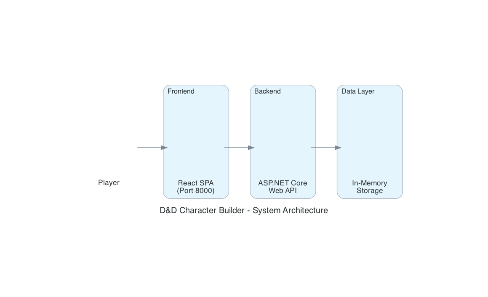
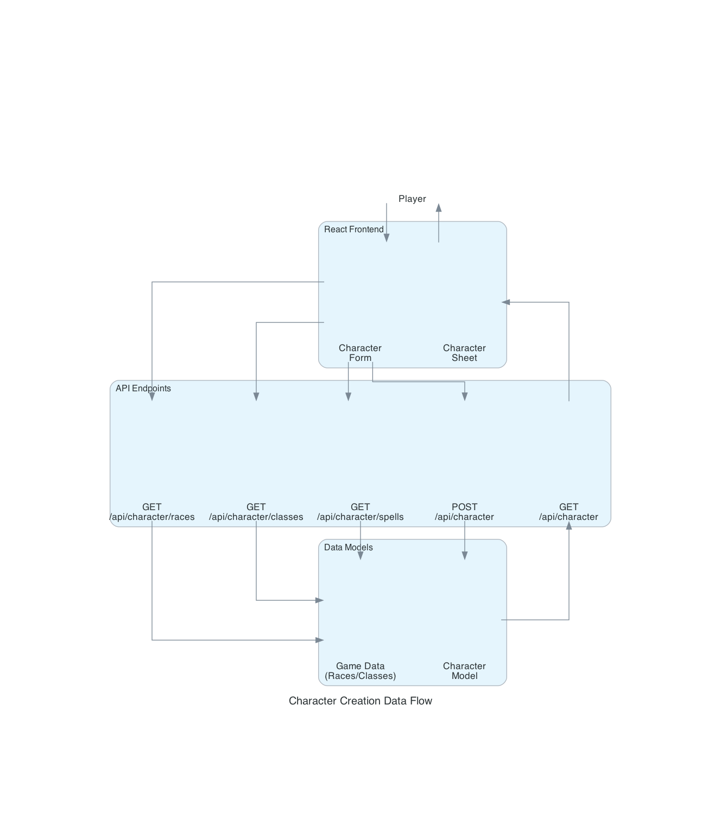
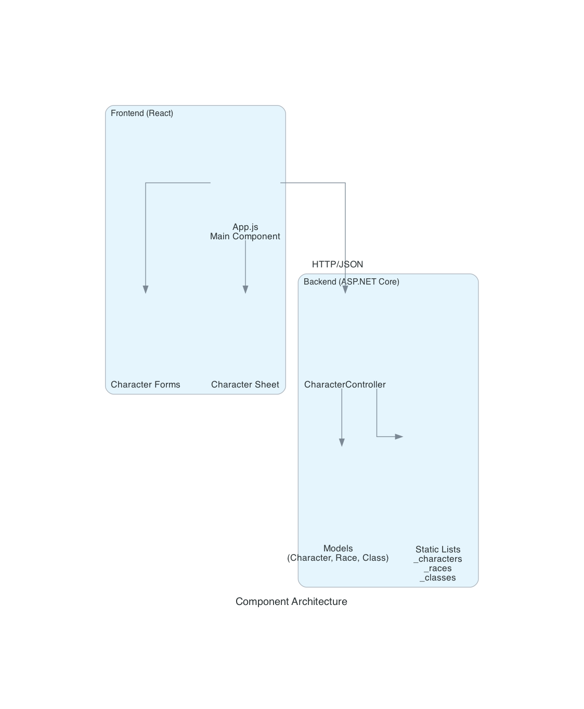
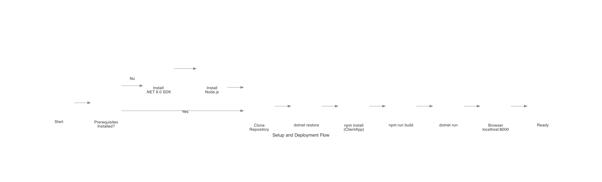

# D&D 5e Character Builder

A comprehensive web-based character builder for Dungeons & Dragons 5th Edition, built with C# ASP.NET Core and React.

**Version:** 2.1.0 (November 2025)

---

## Table of Contents
- [Architecture Overview](#architecture-overview)
- [Features](#features)
- [Technology Stack](#technology-stack)
- [Installation & Setup](#installation--setup)
- [API Reference](#api-reference)
- [Project Structure](#project-structure)
- [D&D 5e Content](#dd-5e-content)
- [Contributing](#contributing)

---

## Architecture Overview

### System Architecture


The application follows a modern client-server architecture:
- **Frontend**: React SPA serving the user interface
- **Backend**: ASP.NET Core Web API handling business logic
- **Data Layer**: In-memory storage for session-based character persistence

### Data Flow


Character creation follows this workflow:
1. Player interacts with React forms
2. Frontend fetches game data (races, classes, spells) from API
3. Character data is posted to API endpoints
4. Backend validates and stores character in memory
5. Character sheet displays complete character information

### Component Architecture


**Frontend Components:**
- `App.js` - Main React component orchestrating UI
- Character Forms - Input components for character creation
- Character Sheet - Display component for viewing characters

**Backend Components:**
- `CharacterController` - RESTful API endpoints
- Models - Data structures (Character, Race, Class, Spell, Equipment)
- Static Storage - In-memory lists for characters and game data

---

## Features

### Core Character Creation
- **Race Selection**: 26 playable races including core PHB races and expanded options
  - Core: Human, Elf, Dwarf, Halfling, Dragonborn, Gnome, Half-Elf, Half-Orc, Tiefling
  - Expanded: Aarakocra, Aasimar, Bugbear, Firbolg, Genasi, Githyanki, Goblin, Goliath, Hobgoblin, Kenku, Kobold, Lizardfolk, Orc, Tabaxi, Tortle, Triton, Yuan-ti Pureblood
- **Class Selection**: All 12 core D&D 5e classes
  - Fighter, Wizard, Rogue, Cleric, Ranger, Paladin, Barbarian, Bard, Druid, Monk, Sorcerer, Warlock
- **Class Features**: Detailed descriptions of class abilities
  - Fighting Style, Second Wind, Action Surge (Fighter)
  - Spellcasting mechanics (Wizard)
  - Expertise, Sneak Attack (Rogue)
- **Background Selection**: 12 classic backgrounds
  - Acolyte, Criminal, Folk Hero, Noble, Sage, Soldier, and more
- **Alignment System**: All 9 D&D alignments
- **Level Progression**: Character levels 1-20 with automatic proficiency bonus calculation

### Ability Score Management
- **Manual Entry**: Set ability scores manually (3-20 range)
- **Random Generation**: 4d6 drop lowest method (authentic D&D rolling)
- **Modifier Calculation**: Automatic modifier calculation and display
- **Race Bonuses**: Automatic application of racial ability score increases

### Spell Management
- **Spell Library**: Curated list of D&D 5e spells with full descriptions
- **Spellcaster Detection**: Automatic spell access based on class selection
- **Spell Details**: Complete spell information
  - Level, school, casting time, range, duration
  - Components (V, S, M)
  - Damage and effects
- **Custom Spell Lists**: Add/remove spells for each character

### Equipment & Inventory
- **Equipment Management**: Add custom equipment with quantities
- **Weapon Stats**: Damage, damage type, properties
- **Armor Stats**: AC values and armor properties
- **Item Categories**: Organize equipment by type
- **Inventory Tracking**: Keep track of all character possessions

### Character Sheet Display
- **Complete Character Sheet**: View all character information in organized format
- **Health & AC Tracking**: Hit points and armor class display
- **Proficiency Bonus**: Automatic calculation based on level
- **Saving Throws**: Display all saving throw modifiers
- **Character Export**: Save and load characters
- **Character Deletion**: Remove characters with file cleanup

---

## Technology Stack

### Backend
| Technology | Version | Purpose |
|------------|---------|---------|
| .NET | 9.0 | Runtime framework |
| ASP.NET Core | 9.0 | Web API framework |
| C# | 12.0 | Programming language |

**Architecture Patterns:**
- RESTful API design
- Model-based architecture
- In-memory data persistence
- Static game data storage

### Frontend
| Technology | Version | Purpose |
|------------|---------|---------|
| React | 18.x | UI framework |
| JavaScript | ES6+ | Programming language |
| CSS3 | - | Styling |

**Features:**
- Component-based architecture
- React Hooks for state management
- Responsive design
- Real-time character updates

---

## Installation & Setup



### Prerequisites
- **.NET 9.0 SDK** - [Download](https://dotnet.microsoft.com/download)
- **Node.js** (v16+) - [Download](https://nodejs.org/)
- **Git** - [Download](https://git-scm.com/)

### Quick Start

```bash
# Clone the repository
git clone https://github.com/harrison-glitch/dnd-character-builder.git
cd dnd-character-builder

# Restore .NET packages
dotnet restore

# Install React dependencies
cd ClientApp
npm install

# Build React frontend
npm run build
cd ..

# Run the application
dotnet run
```

### Access the Application
Open your browser and navigate to:
```
http://localhost:8000
```

### Desktop Launcher (macOS)
A desktop launcher script is available for easy access:
```bash
./start-character-builder.sh
```

---

## API Reference

### Character Management

#### Get All Characters
```http
GET /api/character
```
**Response:**
```json
[
  {
    "id": "uuid",
    "name": "Thorin Ironforge",
    "race": "Dwarf",
    "class": "Fighter",
    "level": 5,
    "abilities": { "strength": 16, "dexterity": 12, ... },
    "hitPoints": 45,
    "armorClass": 18
  }
]
```

#### Get Specific Character
```http
GET /api/character/{id}
```

#### Create Character
```http
POST /api/character
Content-Type: application/json

{
  "name": "Elara Moonwhisper",
  "race": "Elf",
  "class": "Wizard",
  "level": 1,
  "abilities": { "strength": 8, "intelligence": 16, ... }
}
```

#### Update Character
```http
PUT /api/character/{id}
Content-Type: application/json
```

#### Delete Character
```http
DELETE /api/character/{id}
```

### Game Data Endpoints

#### Get Races
```http
GET /api/character/races
```
Returns all available races with traits and ability score increases.

#### Get Classes
```http
GET /api/character/classes
```
Returns all classes with hit dice, primary abilities, and proficiencies.

#### Get Backgrounds
```http
GET /api/character/backgrounds
```

#### Get Alignments
```http
GET /api/character/alignments
```

#### Get Spell Library
```http
GET /api/character/spells
```
Returns complete spell list with descriptions and mechanics.

### Utility Endpoints

#### Generate Ability Scores
```http
POST /api/character/generate-stats
```
**Response:**
```json
{
  "strength": 14,
  "dexterity": 12,
  "constitution": 15,
  "intelligence": 10,
  "wisdom": 13,
  "charisma": 8
}
```

---

## Project Structure

```
character-builder/
├── Controllers/              # API Controllers
│   └── CharacterController.cs
│       - RESTful endpoints
│       - Game data providers
│       - Character CRUD operations
│
├── Models/                   # Data Models
│   └── Character.cs
│       - Character model
│       - AbilityScores
│       - Equipment, Weapon, Armor
│       - Race, CharacterClass
│       - Spell, ClassFeature
│
├── ClientApp/                # React Frontend
│   ├── src/
│   │   ├── App.js           # Main React Component
│   │   ├── App.css          # Styling
│   │   └── index.js         # React Entry Point
│   ├── public/
│   │   └── index.html       # HTML Template
│   └── package.json         # React Dependencies
│
├── wwwroot/                  # Built Frontend Assets
│   ├── index.html
│   ├── asset-manifest.json
│   └── static/              # CSS and JS bundles
│
├── generated-diagrams/       # Architecture Diagrams
│   ├── architecture-overview.png
│   ├── data-flow.png
│   ├── component-architecture.png
│   └── setup-flow.png
│
├── Program.cs                # Application Entry Point
├── CharacterBuilder.csproj   # Project Configuration
├── SAVED CHARACTERS.md       # Character Storage
└── README.md                 # This file
```

---

## D&D 5e Content

### Races (26)
**Core Races:**
- Human, Elf, Dwarf, Halfling, Dragonborn, Gnome, Half-Elf, Half-Orc, Tiefling

**Expanded Races:**
- Aarakocra (flight capability)
- Aasimar (celestial heritage)
- Bugbear (long-limbed, sneaky)
- Firbolg (giant-kin, nature magic)
- Genasi (elemental-touched)
- Githyanki (astral warriors)
- Goblin (nimble escape)
- Goliath (mountain-born giants)
- Hobgoblin (militaristic)
- Kenku (mimicry experts)
- Kobold (pack tactics)
- Lizardfolk (natural armor)
- Orc (aggressive, relentless)
- Tabaxi (feline agility)
- Tortle (natural armor, shell defense)
- Triton (amphibious guardians)
- Yuan-ti Pureblood (magic resistance)

Each race includes:
- Racial traits and special abilities
- Ability score increases
- Unique features (darkvision, resistances, etc.)

### Classes (12)
All core D&D 5e classes with complete information:
- **Fighter**: Hit Die d10, Second Wind, Action Surge
- **Wizard**: Hit Die d6, Spellcasting, Arcane Recovery
- **Rogue**: Hit Die d8, Expertise, Sneak Attack
- **Cleric**: Hit Die d8, Divine Spellcasting
- **Ranger**: Hit Die d10, Natural Explorer
- **Paladin**: Hit Die d10, Divine Smite
- **Barbarian**: Hit Die d12, Rage
- **Bard**: Hit Die d8, Bardic Inspiration
- **Druid**: Hit Die d8, Wild Shape
- **Monk**: Hit Die d8, Martial Arts
- **Sorcerer**: Hit Die d6, Metamagic
- **Warlock**: Hit Die d8, Eldritch Invocations

Each class includes:
- Hit dice and primary abilities
- Saving throw proficiencies
- Skill proficiencies
- Spellcasting capability (where applicable)
- Class features with descriptions

### Spells
Comprehensive spell library including:
- **Cantrips (Level 0)**: Fire Bolt, Mage Hand, Prestidigitation, Eldritch Blast, Sacred Flame, Vicious Mockery
- **Leveled Spells (1-9)**: Complete spell descriptions with mechanics

Each spell includes:
- Level and school of magic
- Casting time, range, duration
- Components (V, S, M)
- Damage and effects
- Full description

---

## Character Creation Workflow

1. **Basic Information**
   - Enter character name
   - Select race (26 options)
   - Select class (12 options)
   - Choose background
   - Set alignment
   - Choose level (1-20)

2. **Ability Scores**
   - Generate random stats (4d6 drop lowest)
   - OR enter manually (3-20 range)
   - Racial bonuses applied automatically
   - Modifiers calculated in real-time

3. **Class Features**
   - View class-specific abilities
   - Read detailed feature descriptions
   - Understand class mechanics

4. **Spell Selection** (for spellcasters)
   - Browse spell library
   - Filter by level and school
   - Add spells to character
   - View complete spell details

5. **Equipment**
   - Add weapons with damage stats
   - Add armor with AC values
   - Track inventory items
   - Manage quantities

6. **Save & View**
   - Save character to storage
   - View complete character sheet
   - Export character data
   - Delete characters when needed

---

## Contributing

This is a personal project for D&D character creation. Contributions are welcome!

### Development Guidelines
- Follow existing code structure
- Test both frontend and backend changes
- Update documentation for new features
- Maintain D&D 5e accuracy

### Future Enhancements
- Database persistence (replace in-memory storage)
- User authentication and character ownership
- Subclass selection
- Feat management
- Multi-classing support
- Character PDF export
- Dice roller integration

---

## License

This project is for educational and personal use. Dungeons & Dragons 5th Edition content is property of Wizards of the Coast.

**Disclaimer:** This is an unofficial fan-made tool and is not affiliated with, endorsed, sponsored, or specifically approved by Wizards of the Coast LLC.

---

## Repository

GitHub: [harrison-glitch/dnd-character-builder](https://github.com/harrison-glitch/dnd-character-builder)

---

**Built with ❤️ for the D&D community**
